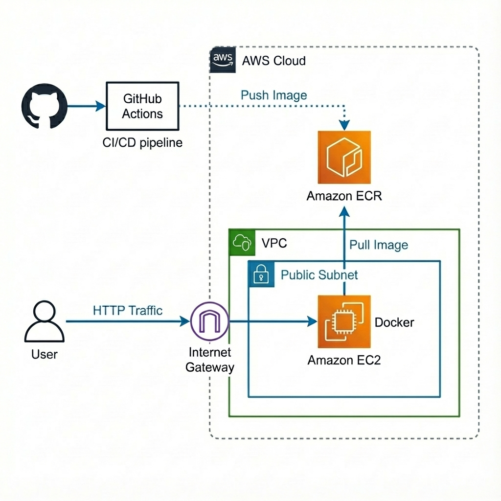

# CloudFlow

A DevOps automation platform demonstrating CI/CD deployment of a Node.js application to AWS using Docker, ECR, and GitHub Actions.

## Overview

This is a full-stack Hello World application with automated infrastructure provisioning and continuous deployment. The project showcases modern DevOps practices including containerization, infrastructure as code, and automated CI/CD pipelines for deploying to AWS.

## Architecture

The application runs on AWS with the following components:



- **Amazon ECR** - Private Docker image repository
- **EC2 Instance** - Hosts the containerized Node.js application
- **Elastic IP** - Static public IP address
- **VPC** - Network isolation with public subnet
- **Security Groups** - Controls traffic to EC2 instance
- **GitHub Actions** - Automated CI/CD pipeline

## Tech Stack

**Backend**
- Node.js 18
- Express.js

**Frontend**
- HTML/CSS
- Vanilla JavaScript

**Infrastructure**
- Terraform for IaC
- AWS (VPC, EC2, ECR, Elastic IP)
- Docker & Docker Compose
- GitHub Actions for CI/CD

## Project Structure

```
├── src/                 # Application source code
│   ├── server.js        # Express server entry point
│   ├── app.js           # Application logic
│   └── public/
│       └── index.html   # Frontend landing page
├── terraform/           # Infrastructure as Code
│   ├── main.tf          # AWS resources
│   ├── variables.tf     # Input variables
│   ├── outputs.tf       # Output values
│   ├── versions.tf      # Provider configuration
│   └── user_data.sh     # EC2 bootstrap script
├── .github/
│   └── workflows/
│       └── CICDPipeline.yml  # CI/CD workflow
├── tests/
│   └── server.test.js   # Test suite
├── Dockerfile           # Multi-stage Docker build
├── docker-compose.yml   # Container orchestration
└── package.json
```

## Deployment

### Prerequisites

- AWS account with configured credentials
- Terraform installed
- AWS CLI configured
- SSH key pair in AWS
- GitHub repository with Actions enabled

### Steps

1. Clone the repository
```bash
git clone https://github.com/tasbirul/CloudFlow.git
cd CloudFlow
```

2. Create EC2 key pair
```bash
aws ec2 create-key-pair \
  --key-name your-key \
  --query 'KeyMaterial' \
  --output text > your-key.pem
chmod 400 your-key.pem
```

3. Deploy infrastructure
```bash
cd terraform
terraform init
terraform plan
terraform apply
```

4. Configure GitHub Secrets
```
AWS_ACCESS_KEY_ID
AWS_SECRET_ACCESS_KEY
AWS_REGION
SSH_PRIVATE_KEY
HOSTNAME (from terraform output)
USERNAME (ubuntu)
```

5. Push to main branch to trigger deployment
```bash
git push origin main
```

The deployment takes approximately 5-7 minutes for initial setup.

## Infrastructure Details

### Networking
- VPC with public subnet (10.0.0.0/16)
- Internet Gateway for public internet access
- Route tables configured for subnet traffic
- Elastic IP for stable public access

### Compute
- EC2 t3.micro instance running Ubuntu 22.04
- Docker and Docker Compose installed via user_data
- IAM instance profile for ECR authentication
- Automated deployment via GitHub Actions

### Container Registry
- Amazon ECR private repository
- Image scanning enabled on push
- Stores Docker images with SHA and latest tags

### Security
- Security groups restrict traffic:
  - EC2: Ports 22, 80, 443, 3000, 8080
- IAM role for EC2-ECR authentication
- Non-root user in Docker container
- SSH key-based authentication

## Local Development

```bash
npm install
npm start
```

Application runs on `http://localhost:3000`

### Docker Development

```bash
docker build -t cloudflow:local .
docker run -p 3000:3000 cloudflow:local
```

## Features

- Automated CI/CD pipeline with GitHub Actions
- Containerized deployment with Docker
- Infrastructure as Code with Terraform
- Secure ECR image storage
- Health checks and monitoring
- Multi-stage Docker builds for optimization

## Configuration

Key Terraform variables in `terraform/variables.tf`:

- `aws_region` - AWS region for deployment (default: us-east-1)
- `vpc_cidr` - VPC CIDR block (default: 10.0.0.0/16)
- `instance_type` - EC2 instance type (default: t3.micro)
- `key_name` - SSH key pair name (default: your-key)
- `ecr_repo_name` - ECR repository name (default: noderepo)
- `container_port` - Application port (default: 3000)

## CI/CD Pipeline

The GitHub Actions workflow automatically:

1. **Build** - Creates Docker image from source
2. **Push** - Uploads to Amazon ECR with SHA and latest tags
3. **Deploy** - SSHs to EC2 and deploys via Docker Compose
4. **Verify** - Checks deployment status

Triggered on every push to the `main` branch.

## Monitoring

Access EC2 instance logs:
```bash
ssh -i your-key.pem ubuntu@INSTANCE_IP
docker logs -f <container_name>
docker ps -a
```

View cloud-init logs:
```bash
sudo cat /var/log/cloud-init-output.log
```

## API Endpoints

- `GET /` - Landing page
- `GET /api/hello` - Returns JSON: `{ message: 'Hello from Node.js backend!' }`

## Troubleshooting

### EC2 Instance Not Accessible
```bash
# Check instance status
aws ec2 describe-instances

# Verify security group rules
# SSH into instance
ssh -i your-key.pem ubuntu@<ELASTIC_IP>
docker ps
```

### Docker Image Pull Failed
```bash
# Re-authenticate with ECR
aws ecr get-login-password --region us-east-1 | \
  docker login --username AWS --password-stdin <ECR_URL>
```

### GitHub Actions Pipeline Fails
- Verify all GitHub secrets are configured
- Check SSH key permissions
- Review GitHub Actions logs

## Cost Estimate

Approximate monthly cost in us-east-1:
- EC2 t3.micro: ~$7.50
- Elastic IP: ~$3.60
- ECR storage: ~$1.00
- Data transfer: ~$2.00
- **Total: ~$15-20/month**

## Cleanup

To destroy all resources:
```bash
cd terraform
terraform destroy
```

## License

MIT License
